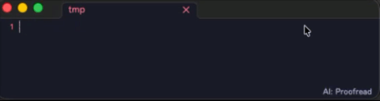

# AI Rewrite

**Line-level AI rewriting for Obsidian** — proofread, translate, or run your own modes. Tuned to run well on small, **local** models (Ollama by default), so it stays fast, private, and easy on your machine. ✨



<!-- Demo script (for re-recording):
     Line 1 (Proofread): type  AI Rewrite fixes you're typos localy, one line at a time.  -> Tab
       -> AI Rewrite fixes your typos locally, one line at a time.
     Switch mode to Translate (status bar / Cycle mode), Target language = English
     Line 2 (Translate): type  現在の行を翻訳することもできます。  -> Tab
       -> It can also translate the current line. -->

- ✍️ Rewrites the **current line** or **selection** on demand — not next-word autocomplete.
- 👻 Shows the result as a **ghost preview** below the line. **Tab** applies, **Esc** dismisses.
- 🎛️ Ships with **Proofread** and **Translate** modes — add your own.
- 🔌 Works with any OpenAI-compatible server: Ollama, LM Studio, OpenAI, OpenRouter…

> [!TIP]
> Why line-level? Correcting one line is easy work for a small model like `gemma3`, and triggering on demand keeps your machine cool — that's the whole design.

## 🚀 Quick start

1. Install [Ollama](https://ollama.com) and pull a model: `ollama pull gemma3`
2. Make sure Ollama is running (`ollama serve` — usually automatic).
3. Install and enable **AI Rewrite**. It defaults to `http://localhost:11434/v1` with model `gemma3`.
4. Put the cursor on a line, run **Correct current line or selection** from the command palette, and press **Tab** to accept.

> [!NOTE]
> Using a different model? Set it under **Settings → AI Rewrite → Model**.

## ⚙️ How it works

```
i beleive their going too the meeting     ← your line (typos)
        ↓  trigger (hotkey · on leave · while typing)
I believe they're going to the meeting    ← ghost preview  ·  Tab applies  ·  Esc dismisses
```

- Reads the **current line** (or your **selection**) and shows the model's reply as a ghost preview.
- Markdown prefixes are preserved — indentation, `- `, `> `, `# `, `1. `, `- [ ] ` — so the model only sees the prose.
- Blank lines are skipped. With a selection, the whole selection (multiple lines) is rewritten and replaced on accept.

## 🎛️ Modes

A mode is just an editable instruction sent to the model. Two ship by default:

| Mode | What it does |
|------|--------------|
| **Proofread** | Fix spelling, grammar, punctuation and typos — same language, same meaning |
| **Translate** | Translate into your target language |

**Switch modes**
- Click the active mode in the **status bar** and pick from the menu.
- Run **Cycle mode** to jump to the next one (bind it to a hotkey).
- Each mode also gets an **Apply …** command — bind it in **Settings → Hotkeys** to switch mode *and* rewrite in one press.

**Add your own**
Create modes under **Settings → Modes** (name + prompt). Put `{targetLang}` in a prompt to fill in the **Target language** setting. Adding or removing a mode takes effect after a reload.

## ⚡ Triggers

Set under **Settings → Trigger**:

| Trigger | When it fires | Best for |
|---------|---------------|----------|
| **On demand** *(default)* | Only when you run a command/hotkey | Least noise, lowest CPU |
| **When leaving a line** | After you move off a line | Hands-off proofreading |
| **While typing** | After a short pause | Most eager |

## 🔗 Auto-link existing notes

Off by default. When enabled, the plugin wraps text matching an existing **note title or alias** in `[[wiki links]]` after a rewrite.

- Case-insensitive; links the **first occurrence** per note.
- Skips code, URLs, and existing links.
- Leaves ambiguous names (claimed by more than one note) alone.

Turn it on under **Settings → Auto-link existing notes**.

## ⌨️ Keys

| Key | Action |
|-----|--------|
| **Tab** / **→** | Apply the suggestion |
| **Esc** | Dismiss |

Keys only intercept while a preview is showing; otherwise they behave normally. Change them under **Settings → Accept keys / Dismiss keys** (space-separated [CodeMirror key names](#key-name-reference)).

## 🌐 Other servers

AI Rewrite talks to any OpenAI-compatible endpoint — set the **Base URL** under **Settings → Connection**.

| Setup | What to set | Privacy |
|-------|-------------|---------|
| **Local, no auth** — Ollama, LM Studio, vLLM | Base URL | Stays fully local |
| **Remote, authenticated** — OpenAI, OpenRouter | Base URL + **API key** | Note content leaves your machine |

> [!WARNING]
> Pointing the Base URL at a remote service sends your note content to that service — it's no longer local-only. The API key is sent as a `Bearer` token.

> [!NOTE]
> A `⟳` shows in the status bar while a request runs. Each request gives up after the **Request timeout** (default 30s) so a stalled model can't jam later suggestions — raise it if a slow model's first response gets cut off.

<details>
<summary><b>📋 Commands</b></summary>

Run from the command palette or bind a hotkey:

- **Correct current line or selection** — rewrite with the active mode
- **Apply &lt;mode&gt; to current line or selection** — switch to that mode, then rewrite
- **Cycle mode** — switch to the next mode
- **Toggle suggestions** — turn the plugin on or off
- **Test connection** — send a short request with the current settings
</details>

<details>
<summary><b>💾 Manual install</b></summary>

Copy `main.js`, `manifest.json` (and `styles.css` if present) into your vault:

```
<Vault>/.obsidian/plugins/ai-rewrite/
```

Then reload Obsidian and enable the plugin in **Settings → Community plugins**.
</details>

## Key name reference

Accept/dismiss keys use **CodeMirror** key names:

- **Key name** = the value of `event.key` for that key — look it up by pressing the key on [keycode.info](https://www.toptal.com/developers/keycode) (e.g. `Tab`, `Enter`, `Escape`, `ArrowRight`, `a`, `1`). The space bar is written `Space`.
- **Modifiers** prefix the key, joined with `-`: `Mod-` (Cmd on macOS, Ctrl elsewhere — best for cross-platform), `Ctrl-`, `Shift-`, `Alt-`, `Cmd-` / `Meta-`.
- **Multiple bindings** are separated by spaces.

Examples: `Tab ArrowRight` · `Escape` · `Ctrl-Space` · `Mod-Enter` · `Shift-Tab`

> [!NOTE]
> Full format: [CodeMirror key bindings](https://codemirror.net/docs/ref/#view.keymap).

## 🛠️ Development

This project uses [pnpm](https://pnpm.io).

```bash
pnpm install   # install dependencies
pnpm dev       # development build (non-minified, inline sourcemaps)
pnpm build     # production build -> main.js (minified)
```

## 📄 License

MIT
